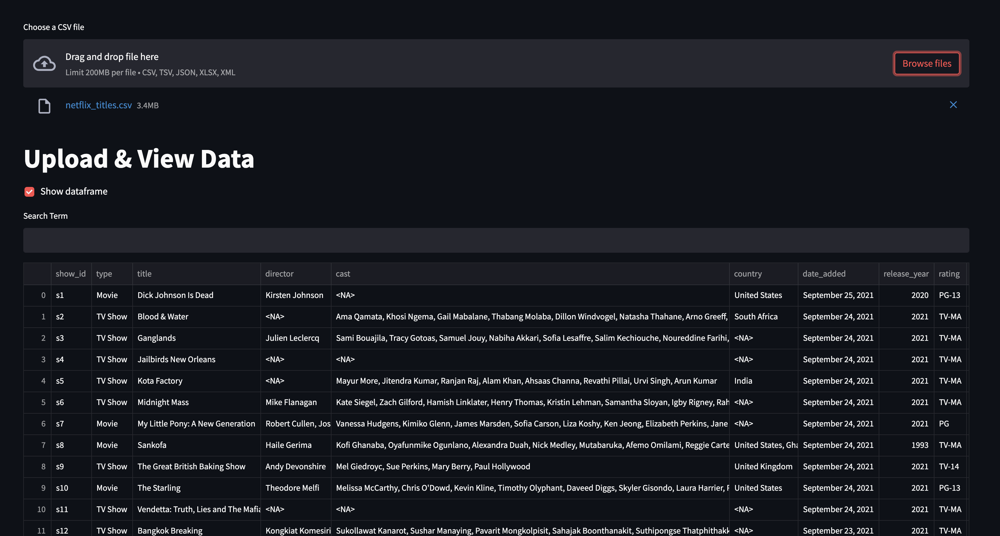
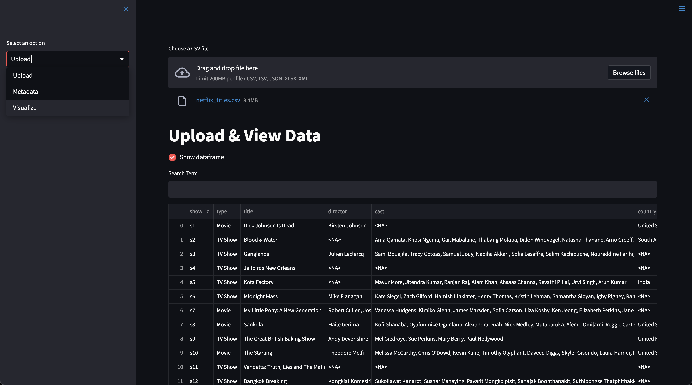
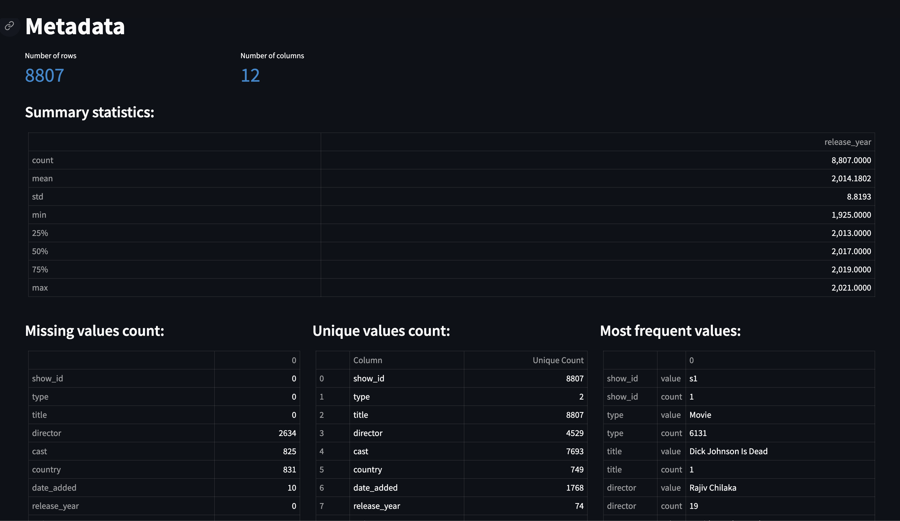
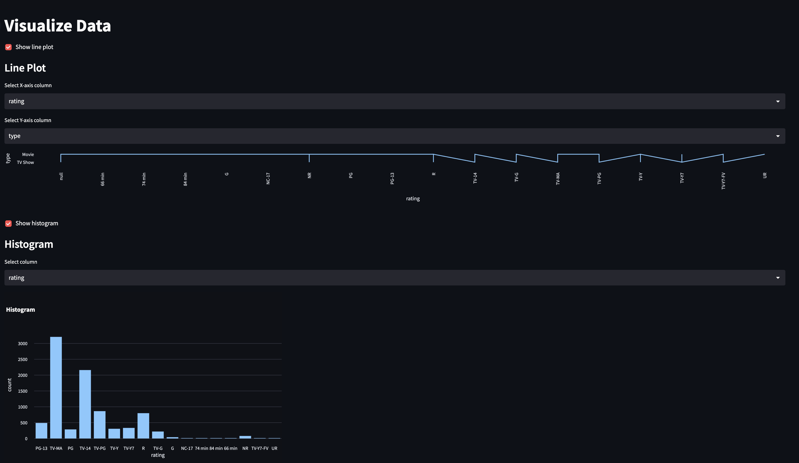

## Introduction
This is a data analysis tool that allows you to upload, view, and visualize your data. You can upload a CSV, TSV, JSON, XLSX, or XML file, and the app will display metadata and visualizations of your data.

## Requirements
The following libraries are required to run this app:

* Streamlit
* Pandas
* Xmltodict (if uploading XML files)
* Matplotlib
* Plotly


## Usage

1. Clone the repository:

```git clone https://github.com/nishantgerald/eda-tool.git```

2. Change into the project directory:
    
    ```cd eda-tool```

3. Install the requirements:

    ```pip install -r requirements.txt```

4. Run the app:

    ```streamlit run app.py```

5. Open the app in your browser:

    ```http://localhost:8501```

6. In the app, select "Upload" from the menu in the sidebar to upload a file. The file will be read into a Pandas dataframe and displayed on the "Upload & View Data" page.


<div align="center"><figcaption align="center"><b>Upload File</b></figcaption></div>


<br>

<div align="center"><figcaption align = "center"><b>Menu Sidebar</b></figcaption></div>

<br>
7. Select "Metadata" from the menu in the sidebar to view metadata of your data, such as the number of rows and columns, and summary statistics.

<div align="center"><figcaption align = "center"><b>Metadata</b></figcaption></div>

<br>
8. Select "Visualize" from the menu in the sidebar to view visualizations of your data. You can select the type of visualization and the columns to visualize.


<div align="center"><figcaption align = "center"><b>Visualization</b></figcaption></div>

## Contributiions

This app is open source and contributions are welcome. If you would like to contribute, please send in a pull request.

## License
This project is licensed under the `MIT license`.

